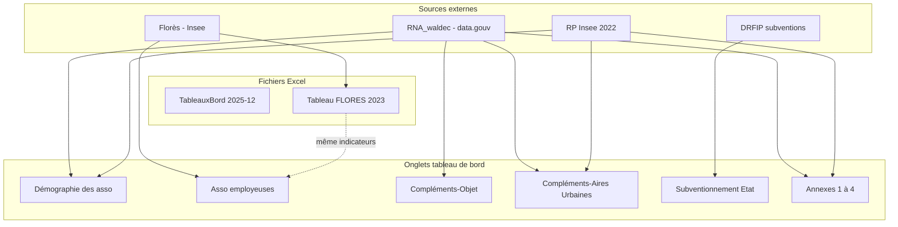

# Structure des données — Observatoire de la vie associative (Pays de la Loire)

Ce document décrit les deux fichiers Excel fournis, leur organisation par onglets, les dimensions géographiques, les indicateurs et les conventions de mise en forme. Il s’appuie sur l’analyse des fichiers présents dans ce dossier (version tableau de bord : **décembre 2025**).

---

## Vue d’ensemble

| Fichier | Rôle | Onglets | Période / fraîcheur |
|---------|------|---------|---------------------|
| `TableauxBord_ChiffresClesAsso-Version-web_2025-12.xlsx` | Tableau de bord principal de l’observatoire (chiffres clés) | **11** | RNA au **01/02/2025** ; historiques 2019–2024 selon les onglets |
| `Tableau FLORES 2023 réalisé par Insee PDL.xlsx` | Extrait Insee **Florès** (emploi salarié en associations) | **1** | Données **décembre 2023** (comparaison 2022 pour les évolutions) |

**Territoire couvert :** région **Pays de la Loire**, ventilée par département :

| Code | Département |
|------|-------------|
| 44 | Loire-Atlantique |
| 49 | Maine-et-Loire |
| 53 | Mayenne |
| 72 | Sarthe |
| 85 | Vendée |
| *(colonne agrégée)* | **Pays de la Loire** |

**Réalisation (tableau de bord) :** Le Compas, pour le compte de la DRAJES Pays de la Loire (`lecompas.fr`).

---

## Modèle de données commun (onglets « indicateurs-clés »)

La majorité des onglets statistiques du tableau de bord suivent le **même schéma matriciel** :

```
[Ligne vide]
┌──────────────────┬─────┬─────┬─────┬─────┬─────┬─────────────────┬ … ┬─────────┬──────────────────┬──────────────┐
│ (vide)           │ 44  │ 49  │ 53  │ 72  │ 85  │ Pays de la Loire│ … │ Source  │ Date(s) données  │ Observations │
├──────────────────┼─────┼─────┼─────┼─────┼─────┼─────────────────┼ … ┼─────────┼──────────────────┼──────────────┤
│ Indicateur 1     │ val │ val │ val │ val │ val │ val             │ … │ …       │ …                │ …            │
│ Indicateur 2     │ …   │ …   │ …   │ …   │ …   │ …               │ … │ …       │ …                │ …            │
└──────────────────┴─────┴─────┴─────┴─────┴─────┴─────────────────┴ … ┴─────────┴──────────────────┴──────────────┘
```

### Colonnes standard

| Position | Libellé type | Contenu |
|----------|--------------|---------|
| **A** | *(souvent vide)* | Marge / alignement |
| **B** | `Indicateurs-clés` | Libellé de l’indicateur (dimension « métrique ») |
| **C–G** | `44`, `49`, `53`, `72`, `85` | Valeur par département |
| **H** | `Pays de la Loire` | Total ou agrégat régional |
| **I–M** *(selon onglet)* | `Rappel PDL — Version précédente (Données …)` | Séries historiques du tableau de bord (snapshots RNA aux dates 01/02/2019, 01/10/2020, 01/02/2021–2023) |
| **N** *(ou I)* | `France métropolitaine` | Référence nationale *(onglet Asso employeuses uniquement, ou fichier Florès)* |
| **Source(s)** | Provenance | ex. `DATAGOUV – Fichier RNA_waldec`, `Florès 2023`, `Insee RP 2022` |
| **Date(s) des données`** | Référence temporelle | Date unique, plage (`2019-2025`), ou libellé multi-lignes |
| **Observations`** | Notes | Texte libre ou codes renvoyant aux notes de bas de feuille *(ex. `-1`, `-2` dans Florès)* |

### Types de valeurs

- **Effectifs** : entiers (nombre d’associations, salariés, créations, subventions en euros).
- **Parts / répartitions** : décimales entre 0 et 1 *(ex. 0,32 = 32 %)* ; les lignes « répartition par département » totalisent **1** à l’échelle régionale.
- **Évolutions** : taux en **%** *(décimal ou pourcentage selon la ligne — libellé « en % »)*.
- **Ratios** : associations pour 1 000 habitants, salariés par association, rapport salariés / ETP.

### Sources principales

| Source | Usage |
|--------|--------|
| **RNA_waldec** (data.gouv) | Associations actives, dissoutes, créations, répartitions par objet, aires urbaines, arrondissements |
| **Florès** (Insee) | Associations employeuses, salariés, ETP, rémunérations |
| **Insee — Recensement population (RP 2022)** | Dénominateurs « pour 1 000 habitants » |
| **Extraction DRFIP (MATT, déc. 2020)** | Subventions de l’État aux associations par BOP |
| **Dataasso** *(objet)* | Ventilation « objet » des dissolutions *(onglet Ann-1)* |

**Précaution importante** *(onglet Définitions)* : le RNA_waldec ne contient que les associations créées ou ayant **déclaré depuis 2009**. Une association active mais sans déclaration récente peut **apparaître** dans une version ultérieure du tableau sans avoir été comptée auparavant — les évolutions du stock ne reflètent pas uniquement créations et dissolutions officielles.

---

## Fichier 1 — `Tableau FLORES 2023 réalisé par Insee PDL.xlsx`

**Contenu :** extrait régional du fichier localisé des rémunérations et de l’emploi salarié (**Florès**), centré sur les **associations employeuses**.

### Onglet : `Asso employeuses` (33 × 12)

**En-tête (ligne 2) :** `Indicateurs-clés` | départements 44–85 | `Pays de la Loire` | `France métropolitaine` | `Source(s)` | `Date(s) des données` | `Observations`

**Indicateurs (13 métriques + notes de bas de page) :**

| # | Indicateur |
|---|------------|
| 1 | Nombre d'associations employeuses |
| 2 | Évolution annuelle du nb d'associations employeuses — dernières années connues (%) |
| 3 | Répartition par département du nombre d'associations employeuses (total = 100 %) |
| 4 | Nombre de salariés en associations |
| 5 | Évolution annuelle du nb de salariés en association (%) |
| 6 | Répartition par département du nombre de salariés (total = 100 %) |
| 7 | Nombre moyen de salariés par association |
| 8 | Part des salariés en association parmi l'ensemble des salariés (%) |
| 9 | Nombre d'ETP en associations |
| 10 | Répartition par département du nombre d'ETP (total = 100 %) |
| 11 | Nombre moyen d'ETP par association |
| 12 | Rapport entre le nombre de salariés et le nombre d'ETP |
| 13 | Poids des rémunérations des associations dans l'ensemble des rémunérations (%) |

**Notes de bas de feuille (lignes 27–33) :** définition du champ *(établissements employeurs actifs dernière semaine de décembre, hors défense)*, statut juridique association loi 1901, distinction **effectif salarié** vs **ETP**, renvois `(1)` et `(2)` dans la colonne Observations.

**Champ Florès :** établissements employeurs durant l'année, actifs la dernière semaine de décembre ; associations = catégorie juridique « Association loi 1901 » au niveau de l'unité légale.

---

## Fichier 2 — `TableauxBord_ChiffresClesAsso-Version-web_2025-12.xlsx`

Tableau de bord consolidé : **démographie associative** (RNA), **emploi** (Florès), **compléments** thématiques et territoriaux, **subventions**, **annexes** détaillées.

### Onglet : `Titre` (29 × 2)

Métadonnées du document (peu de cellules renseignées dans l’export) :

- **Sources** : RNA_waldec au 01/02/2025 ; Florès 2018-2019 ; extraction DRFIP (MATT, déc. 2020).
- **Réalisation** : Le Compas / DRAJES Pays de la Loire.

*L’intitulé complet du tableau de bord peut être porté par la version web plutôt que par cet onglet.*

---

### Onglet : `Démographie des asso` (58 × 16)

**Donnée de référence :** RNA_waldec au **01/02/2025**.

**Colonnes supplémentaires :** cinq colonnes « Rappel PDL — version précédente » (snapshots 2019, 2020, 2021, 2022, 2023) pour comparer les publications successives de l’observatoire.

**Indicateurs (16 lignes de données) :**

| Thème | Indicateurs |
|-------|-------------|
| **Stock actif** | Nombre d'associations actives ; répartition départementale (%) ; évolution annuelle moyenne sur 5 ans (%) ; associations pour 1 000 hab.* |
| **Dissolutions** | Nombre d'associations dissoutes ; parts par tranche de durée de vie (<5 ans, 5–9, 10–19, 20–29, 30–39, ≥40 ans) |
| **Dynamique récente** | Créations sur la dernière année connue ; part des créations (%) ; associations récentes (<5 ans) et part (%) ; moyenne annuelle de créations sur 5 ans |

\* Dénominateur population : Insee RP 2022.

---

### Onglet : `Asso employeuses` (19 × 13)

Même logique que le fichier Florès dédié, enrichie pour le tableau de bord :

- Colonne **`Rappel PDL — Version précédente`** (une snapshot).
- Indicateur supplémentaire : **Part des associations employeuses (%)** parmi les associations actives RNA_waldec.
- **14 indicateurs** alignés sur Florès (employeurs, salariés, ETP, évolutions, répartitions, ratios).

**Sources :** Florès 2023 (aligné sur l’extrait Insee) ; dates et observations analogues au fichier Florès.

---

### Onglet : `Compléments-Objet` (48 × 16)

Structure **hiérarchique par objet social** (nomenclature **Dataasso** / observatoire) :

Pour chaque **objet** (8 catégories + total), quatre sous-indicateurs :

1. Effectif ou libellé de catégorie  
2. **Part** parmi l'ensemble des associations du département  
3. **Évolution annuelle moyenne** sur 5 ans (%)  
4. **Part des créations** sur la dernière année entière connue (%)

**Catégories d'objet :**

- Loisirs et Vie sociale  
- Sport  
- Culture  
- Santé et Action sociale  
- Education et Formation  
- Economie et Développement local  
- Environnement et Patrimoine  
- Autres et Divers  

**Ligne d’ouverture :** `Nombre total d'associations actives`.

---

### Onglet : `Compléments-Cat Aires Urbaines` (52 × 16)

Deux blocs thématiques :

#### 1. Zonage Insee en aires urbaines (2010)

Pour chaque **catégorie de commune** dans le zonage :

- Effectif d'associations (ou libellé de catégorie)  
- Part dans le département (%)  
- Nombre d'associations pour 1 000 habitants*

**Catégories (exemples) :**

- Grand pôle (≥ 10 000 emplois) et couronne  
- Commune multipolarisée (grandes aires urbaines)  
- Moyen pôle (5 000–10 000 emplois) et couronne  
- Petit pôle (1 500–5 000 emplois) et couronne  
- Autre commune multipolarisée  
- Commune isolée hors influence des pôles  

#### 2. Zones de revitalisation rurale (ZRR)

- Associations en commune classée ZRR  
- Répartition départementale (%)  
- Part et ratio pour 1 000 habitants  

**Cellules fusionnées :** 1 zone fusionnée sur cet onglet (titres de section).

---

### Onglet : `Subventionnement Etat` (56 × 6)

**Format différent** du modèle « indicateurs-clés » : tableau **BOP × années**.

| Structure | Détail |
|-----------|--------|
| **Lignes** | Budgets opérationnels de programme (BOP) : DRDJSCS, DREAL, DIRECCTE, DRAC, Préfecture de région, Préfectures départementales 44/49/53/72/85, Rectorat, DRAAF 44, etc. |
| **Colonnes** | Années **2015 à 2019** (montants en euros) |
| **Sections** | (1) Récapitulatif ; (2) Détail avec sous-lignes « dont … » |
| **Total** | Ligne `Total général` |
| **Source** | Extraction DRFIP — MATT — décembre 2020 |

**Note :** données antérieures au reste du tableau de bord (2025) ; pas de ventilation départementale sur cet onglet.

---

### Onglet : `Ann-1 - Asso dissoutes x Objet` (68 × 27)

**Format :** blocs **empilés par année de dissolution**, chaque bloc en double (effectifs + parts).

**Années couvertes :** 2019 à 2024.

**Par bloc (ex. année 2024) :**

| Colonnes (bloc gauche) | Colonnes (bloc droit) |
|------------------------|------------------------|
| `Objet Dataasso` | Libellé objet |
| 44, 49, 53, 72, 85 | Effectifs dissous par département |
| `Pays-de-la-Loire` | Total régional |
| *(miroir)* | Mêmes objets avec **parts** par département (décimales, total ligne = 1) |

**8 objets + ligne Total** par année.

---

### Onglet : `Ann-2 - Asso par arrondissement` (30 × 13)

**Granularité :** arrondissement départemental (sous-département).

| Colonne | Contenu |
|---------|---------|
| `DEP` | Code département |
| `Arrondissement` | Nom |
| `Nombre d'associations actives` | Série temporelle : 01/02/2019, 01/10/2020, 01/02/2021, 2022, 2023, **01/02/2025** |
| `%` au 01/02/2025 | Part dans le département |
| `Evolution 2019-2025` | Variation absolue ou relative sur la période |
| `Nb d'associations pour 1000 hab` | Ratio (RP-Insee 2022) |

**Regroupements :** sous-totaux par département (ex. Loire-Atlantique = Nantes + Saint-Nazaire + Châteaubriant-Ancenis) ; total **Pays de la Loire** en fin de tableau.

**Cellules fusionnées :** 12 *(titres / en-têtes)*.

---

### Onglet : `Ann-3 - Créations 2019-2022` (36 × 19)

**Titre interne :** créations par **mois** ; comparaison **2024 vs 2019** (le nom de l’onglet mentionne 2019–2022 mais les données incluent 2024).

**Structure en deux parties :**

1. **Effectifs** : pour chaque mois (janvier–décembre), colonnes 44, 49, 53, 72, 85, `PDL` ; à droite **évolution absolue** 2019→2024 par département.  
2. **Évolution en %** : mêmes dimensions, taux de variation.

**Lignes :** 12 mois + `Total`.

---

### Onglet : `Ann-4 - Créations x objet` (32 × 23)

**Croisement** mois × **objet Dataasso** (8 catégories + Autres et divers).

**Colonnes d’objet :** Culture ; Economie et développement local ; Education et formation ; Environnement et patrimoine ; Loisirs et vie sociale ; Santé et action sociale ; Sport ; Autres et divers ; **Total**.

**Années comparées :** **2024** (effectifs) et **2019** (référence) ; section « Evolution 2019-2022 (en %) » — libellé historique, calculs sur 2019 vs 2024.

**Format :** deux blocs (effectifs mensuels + évolutions en %), comme Ann-3.

---

### Onglet : `Définitions, sources & autres` (19 × 9)

Texte **non tabulaire** : glossaire, précautions d’usage RNA_waldec, définition des aires urbaines Insee (lien insee.fr), définition des associations dissoutes.

**Cellules fusionnées :** 3.

---

## Relations entre les fichiers



- L’onglet **`Asso employeuses`** du tableau de bord et le fichier **`Tableau FLORES 2023`** recoupent les **mêmes indicateurs Florès** ; le fichier Insee est une source autonome avec comparaison **France métropolitaine**.
- Les onglets **`Compléments-*`** et **`Démographie des asso`** s’appuient sur le **RNA_waldec** (base « waldec » = associations avec déclaration depuis 2009).
- Les **annexes** détaillent des dimensions absentes du socle « chiffres clés » : objet des dissolutions, arrondissements, saisonnalité des créations.

---

## Recommandations pour l’exploitation (ETL / base de données)

1. **Normaliser la géographie** : table `departement(code, nom)` + table `arrondissement` pour Ann-2 ; code région `52` ou libellé `Pays de la Loire`.
2. **Parser l’onglet par onglet** : ne pas appliquer un seul `header=1` à tout le classeur (Subventionnement et annexes ont des grilles différentes).
3. **Identifier la ligne d’en-tête** : ligne 2 (`index=1`) pour les onglets « Indicateurs-clés » ; lignes variables pour Ann-1 à Ann-4.
4. **Séparer métadonnées** : colonnes `Source`, `Date`, `Observations` → tables de faits + table de traçabilité.
5. **Décoder les objets** : nomenclature à 8 postes (+ Autres) réutilisée dans Compléments-Objet, Ann-1 et Ann-4.
6. **Attention aux pourcentages** : vérifier si la valeur est stockée en **0–1** ou **0–100** selon l’indicateur (libellé « en % » mais stockage souvent en décimal).
7. **Historique RNA** : les colonnes « Rappel PDL » ne sont pas des années civiles homogènes — conserver la **date de snapshot** dans le libellé de colonne.

---

## Inventaire récapitulatif des onglets

| # | Fichier | Onglet | Lignes × Colonnes | Type de grille |
|---|---------|--------|-------------------|----------------|
| 1 | Florès 2023 | Asso employeuses | 33 × 12 | Indicateurs-clés + FR métropole |
| 2 | Tableau de bord | Titre | 29 × 2 | Métadonnées |
| 3 | Tableau de bord | Démographie des asso | 58 × 16 | Indicateurs-clés + historique observatoire |
| 4 | Tableau de bord | Asso employeuses | 19 × 13 | Indicateurs-clés + rappel + FR |
| 5 | Tableau de bord | Compléments-Objet | 48 × 16 | Hiérarchie objet × 4 indicateurs |
| 6 | Tableau de bord | Compléments-Cat Aires Urbaines | 52 × 16 | Hiérarchie zonage × 3 indicateurs |
| 7 | Tableau de bord | Subventionnement Etat | 56 × 6 | BOP × années 2015–2019 |
| 8 | Tableau de bord | Ann-1 - Asso dissoutes x Objet | 68 × 27 | Année × objet × (effectif + part) |
| 9 | Tableau de bord | Ann-2 - Asso par arrondissement | 30 × 13 | Arrondissement × série temporelle |
| 10 | Tableau de bord | Ann-3 - Créations 2019-2022 | 36 × 19 | Mois × département × 2 années |
| 11 | Tableau de bord | Ann-4 - Créations x objet | 32 × 23 | Mois × objet × 2 années |
| 12 | Tableau de bord | Définitions, sources & autres | 19 × 9 | Documentation |

---

*Document généré par analyse automatisée des classeurs Excel — mai 2026.*
