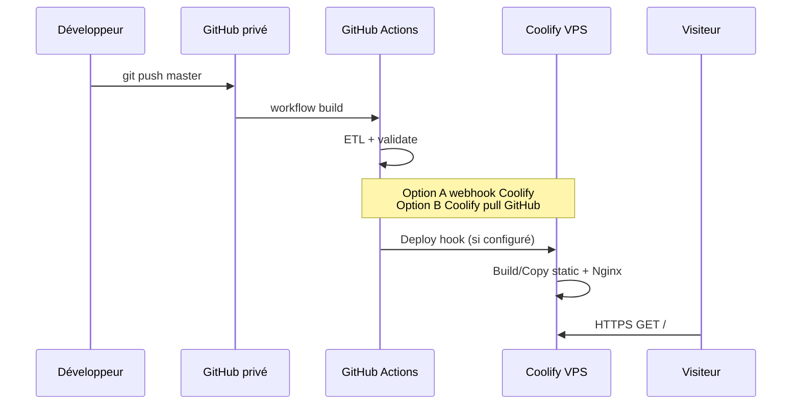

# PRD — Observatoire de la vie associative en ligne

**Produit :** Observatoire numérique de la vie associative  
**Territoire cible (v1) :** Pays de la Loire — focus départemental **Maine-et-Loire (49)** avec comparaison interdépartementale  
**Version du document :** 1.1  
**Date :** 23 mai 2026  
**Statut :** Arbitré  

**URL de production (Coolify) :** `https://observatoireVA.bb49.uk` *(sous-domaine généré par Coolify ; à confirmer à la création de la ressource)*  

### Décisions produit (23 mai 2026)

| Sujet | Décision |
|-------|----------|
| **Accès** | Site **public** — aucune authentification, aucune restriction |
| **Validation institutionnelle** | **Non requise** avant mise en ligne |
| **Domaine** | Fourni par **Coolify** — cible probable `observatoireVA.bb49.uk` |
| **Périmètre données** | **100 % des chiffres** présents dans les deux fichiers Excel documentés dans `structure-donnees.md` doivent être exposés sur le site |

**Documents connexes :**

- [`Données Vie associative/structure-donnees.md`](Données%20Vie%20associative/structure-donnees.md) — inventaire des sources Excel et schémas par onglet  
- [`index.html`](index.html) — prototype SPA statique existant (~10 indicateurs, carte, graphiques)  
- Dépôt Git cible : `github.com/deuzben-ai/observatoireVA` (privé)  
- Hébergement cible : VPS personnel via **Coolify**

---

## Table des matières

1. [Résumé exécutif](#1-résumé-exécutif)  
2. [Contexte et problème](#2-contexte-et-problème)  
3. [Vision produit](#3-vision-produit)  
4. [Parties prenantes et personas](#4-parties-prenantes-et-personas)  
5. [Périmètre fonctionnel](#5-périmètre-fonctionnel)  
6. [Exigences fonctionnelles détaillées](#6-exigences-fonctionnelles-détaillées)  
7. [Données et pipeline](#7-données-et-pipeline)  
8. [Architecture technique](#8-architecture-technique)  
9. [Expérience utilisateur et design](#9-expérience-utilisateur-et-design)  
10. [Exigences non fonctionnelles](#10-exigences-non-fonctionnelles)  
11. [Sécurité, conformité et légal](#11-sécurité-conformité-et-légal)  
12. [Déploiement et DevOps (GitHub + Coolify)](#12-déploiement-et-devops-github--coolify)  
13. [Roadmap et phasage](#13-roadmap-et-phasage)  
14. [Critères de succès et KPIs](#14-critères-de-succès-et-kpis)  
15. [Risques, dépendances et hypothèses](#15-risques-dépendances-et-hypothèses)  
16. [Décisions produit](#16-décisions-produit)  
17. [Annexes](#17-annexes)

---

## 1. Résumé exécutif

### 1.1 Objectif

Mettre en ligne un **observatoire interactif public** de la vie associative (`https://observatoireVA.bb49.uk`), exposant **l’intégralité des chiffres** des tableaux Excel régionaux, **versionné sur GitHub (dépôt privé)** et **déployé** sur VPS via **Coolify** — sans authentification ni validation institutionnelle préalable.

### 1.2 Proposition de valeur

| Pour qui | Valeur |
|----------|--------|
| Élus, services déconcentrés, associations | Chiffres clés lisibles, comparables entre départements, avec sources et dates explicites |
| Chargés de mission « vie associative » | Mise à jour annuelle maîtrisée (Excel → site) sans développement lourd |
| Public informé | Transparence sur le tissu associatif régional (RNA, emploi, dynamiques) |

### 1.3 État actuel (livrable existant)

Un **prototype fonctionnel** [`index.html`](index.html) :

- Application **monopage statique** (HTML/CSS/JS inline)  
- **~10 indicateurs** issus de l’onglet « Démographie des asso »  
- Visualisations : **carte choroplèthe** (Leaflet + GeoJSON départements PDL), **barres** (Plotly), **tableau modal**  
- Données embarquées en JSON dans la page (`const DATA`, `const PDL_GEOJSON`)  
- Identité visuelle orientée **Maine-et-Loire (49)** avec comparaison des 5 départements  

**Écart principal à combler :** le prototype n’expose qu’**~10 indicateurs sur 16** de la démographie ; il manque emploi (Florès), compléments objet/territoire, subventions, les 4 annexes et le fichier Florès dédié. La **v1 exige la couverture intégrale** de tous les onglets chiffrés.

### 1.4 Décision d’architecture recommandée (v1)

| Choix | Justification |
|-------|----------------|
| **Site statique** (HTML/JS/CSS + JSON) | Aligné avec le prototype, coût d’hébergement minimal, déploiement Coolify trivial (Nginx ou « Static Site ») |
| **Pas de backend applicatif en v1** | Données publiques agrégées ; mise à jour par pipeline build/commit |
| **Séparation données / présentation** | Fichiers `data/*.json` générés depuis Excel, consommés par le front |
| **Script ETL Python** (pandas/openpyxl) | Reproductibilité des conversions documentées dans `structure-donnees.md` |

---

## 2. Contexte et problème

### 2.1 Contexte institutionnel

L’observatoire s’appuie sur des publications existantes :

- **Tableau de bord** `TableauxBord_ChiffresClesAsso-Version-web_2025-12.xlsx` (11 onglets, RNA au 01/02/2025)  
- **Extrait Florès** `Tableau FLORES 2023 réalisé par Insee PDL.xlsx` (emploi salarié en associations)  
- **Réalisation historique :** Le Compas pour la DRAJES Pays de la Loire  

Sources de données : RNA_waldec (data.gouv), Florès (Insee), RP Insee 2022, DRFIP (subventions), nomenclature objet Dataasso.

### 2.2 Problème utilisateur

Aujourd’hui, les indicateurs sont **enfermés dans Excel** :

- Navigation multi-onglets peu accessible au grand public  
- Pas de vue cartographique unifiée ni de parcours thématique  
- Mise en ligne manuelle et peu industrialisée  
- Risque d’erreur lors de copies manuelles vers le web  

### 2.3 Opportunité

Un site dédié permet de :

- **Valoriser le département 49** tout en situant les résultats dans la région  
- **Publier rapidement** après réception d’un nouveau fichier Excel  
- **Tracer** sources, dates et mises en garde méthodologiques (RNA depuis 2009, etc.)  

---

## 3. Vision produit

### 3.1 Vision (12–18 mois)

> *« Référence en ligne pour comprendre la vie associative en Pays de la Loire, avec une entrée par le Maine-et-Loire, des comparaisons territoriales fiables et une mise à jour annuelle transparente. »*

### 3.2 Principes directeurs

1. **Fidélité aux sources** — chaque chiffre affiché avec source et date.  
2. **Comparaison avant tout** — départements 44, 49, 53, 72, 85 + agrégat PDL.  
3. **Prudence statistique** — encarts sur les limites du RNA_waldec et les ruptures de série.  
4. **Simplicité de maintenance** — mise à jour = nouveau Excel + commande de build + déploiement Git.  
5. **Performance et sobriété** — site statique, peu de dépendances, hébergement léger.  

### 3.3 Non-objectifs (hors périmètre v1)

- Recherche d’associations par nom, SIREN ou RNA en temps réel  
- Espace utilisateur / comptes / contributions citoyennes  
- API publique documentée (envisageable v2+)  
- Couverture nationale ou multi-régions  
- Remplacement des outils métiers internes (BI, Excel source de vérité conservé en amont)  

---

## 4. Parties prenantes et personas

### 4.1 Parties prenantes

| Rôle | Intérêt | Implication projet |
|------|---------|-------------------|
| **Porteur / commanditaire** (vous) | Site en ligne, déploiement maîtrisé | Product owner, admin GitHub/Coolify |
| **DRAJES / services régionaux** | Diffusion des chiffres clés | Source des données ; pas de gate de validation projet |
| **Le Compas** (producteur historique) | Cohérence méthodologique | Source historique des tableaux Excel ; crédits sur le site |
| **Visiteurs grand public** | Comprendre les tendances | Utilisateurs finaux |
| **Hébergeur (VPS / Coolify)** | Disponibilité, sécurité | Exploitation |

### 4.2 Personas

#### Persona A — « Marie, élue locale »

- **Besoin :** Chiffre clé et comparaison 49 vs voisins en < 2 minutes  
- **Parcours :** Accueil → KPI Maine-et-Loire → carte → export capture pour réunion  
- **Critère de succès :** Libellés clairs, pas de jargon technique  

#### Persona B — « Thomas, chargé de mission associatif »

- **Besoin :** Mettre à jour le site après réception du Excel annuel  
- **Parcours :** Remplacer fichier source → lancer script → commit → déploiement auto Coolify  
- **Critère de succès :** Procédure documentée en < 30 min, sans modifier le JS à la main  

#### Persona C — « Léa, journaliste / chercheuse »

- **Besoin :** Sources, dates, définitions, téléchargement des données  
- **Parcours :** Page Méthodologie → lien data.gouv / Insee → export CSV/JSON  
- **Critère de succès :** Traçabilité complète, mentions légales  

---

## 5. Périmètre fonctionnel

### 5.1 Modules produit (vue macro)

```
┌─────────────────────────────────────────────────────────────┐
│  En-tête : titre, date de référence, KPI 49 + KPI région   │
├──────────────┬──────────────────────────────────────────────┤
│  Navigation  │  Zone principale                            │
│  thématique  │  · Carte départements PDL                   │
│              │  · Graphique comparatif                       │
│              │  · Panneau contexte (source, trend, notes)    │
├──────────────┴──────────────────────────────────────────────┤
│  Pages secondaires : Méthodologie | À propos | Annexes      │
└─────────────────────────────────────────────────────────────┘
```

### 5.2 Thématiques alignées sur les données

**Tous les modules sont P0 pour la v1** — condition de go-live.

| Module | Source Excel (onglet) | Priorité | Statut prototype |
|--------|----------------------|----------|------------------|
| **M1 — Démographie associative** | `Démographie des asso` | **P0** | ~10 / 16 indicateurs |
| **M2 — Emploi & associations employeuses** | `Asso employeuses` + `Tableau FLORES 2023…` | **P0** | Non intégré |
| **M3 — Répartition par objet** | `Compléments-Objet` | **P0** | Non intégré |
| **M4 — Territoires (aires urbaines, ZRR)** | `Compléments-Cat Aires Urbaines` | **P0** | Non intégré |
| **M5 — Subventions État** | `Subventionnement Etat` | **P0** | Non intégré |
| **M6 — Annexes détaillées** | `Ann-1` … `Ann-4` | **P0** | Non intégré |
| **M7 — Méthodologie & définitions** | `Définitions, sources & autres` + `Titre` | **P0** | Partiel (sources en footer) |

### 5.3 Couverture données obligatoire (100 %)

Exigence **DATA-FULL** : tout **valeur numérique** et toute **série temporelle** présente dans les classeurs sources doit être importée par l’ETL et **accessible** sur le site (visualisation ou tableau téléchargeable équivalent à l’onglet Excel).

| Fichier | Onglet | Contenu chiffré à intégrer |
|---------|--------|----------------------------|
| `TableauxBord_…2025-12.xlsx` | `Démographie des asso` | 16 indicateurs × 5 deps + PDL + colonnes rappel historique |
| | `Asso employeuses` | 14 indicateurs (+ France métropolitaine) |
| | `Compléments-Objet` | Total + 8 objets × (effectif implicite, part, évolution 5 ans, part créations) |
| | `Compléments-Cat Aires Urbaines` | Zonage aires urbaines + bloc ZRR (parts, ratios / 1 000 hab.) |
| | `Subventionnement Etat` | Récapitulatif + détail BOP × années 2015–2019 |
| | `Ann-1 - Asso dissoutes x Objet` | Dissolutions par année (2019–2024) × objet × dep (effectifs + parts) |
| | `Ann-2 - Asso par arrondissement` | Série 2019–2025 par arrondissement + ratios |
| | `Ann-3 - Créations 2019-2022` | Créations mensuelles 2019 vs 2024 + évolutions % |
| | `Ann-4 - Créations x objet` | Créations mensuelles × 8 objets + évolutions % |
| `Tableau FLORES 2023…xlsx` | `Asso employeuses` | 13 indicateurs Florès (+ notes méthodologiques textuelles) |

**Hors périmètre chiffré :** cellules purement vides ou titres sans donnée ; textes de définition → page Méthodologie (M7).

**Contrôle qualité ETL :** script `validate_coverage.py` comparant le nombre de cellules numériques extraites vs attendu par onglet (seuil **100 %**, tolérance 0 sur les zones données documentées dans `structure-donnees.md`).

### 5.4 Périmètre géographique

| Niveau | v1 |
|--------|-----|
| Région PDL | Agrégats, comparaisons |
| 5 départements | Carte, tableaux, barres (vue par défaut) |
| Arrondissements | Onglet Ann-2 — tableaux / graphiques dédiés |
| Communes | Non (pas dans les sources fournies) |

---

## 6. Exigences fonctionnelles détaillées

### 6.0 Exigence transversale — couverture intégrale

| ID | Exigence | Priorité | Acceptance criteria |
|----|----------|----------|---------------------|
| **DATA-FULL** | Tous les chiffres des 2 fichiers xlsx sont importés et consultables | **P0** | `validate_coverage.py` retourne 100 % ; chaque onglet listé en 5.3 a une entrée dans l’UI ou un export CSV équivalent |

### 6.1 Navigation et structure

| ID | Exigence | Priorité | Acceptance criteria |
|----|----------|----------|---------------------|
| NAV-01 | Menu latéral ou tabs par **thématique** (M1–M7) | P0 | 7 entrées visibles, état actif persistant à la navigation |
| NAV-02 | Liste d’**indicateurs** filtrée par thématique | P0 | Sélection d’un indicateur met à jour carte + graphique + KPI |
| NAV-03 | URL **partageable** par indicateur (`?theme=demo&id=4` ou hash) | P1 | Rechargement de page restaure l’indicateur |
| NAV-04 | Fil d’Ariane sur pages secondaires | P2 | Méthodologie / Annexes accessibles depuis le footer |

### 6.2 Visualisation des indicateurs (cœur métier)

| ID | Exigence | Priorité | Acceptance criteria |
|----|----------|----------|---------------------|
| VIZ-01 | **Carte choroplèthe** des 5 départements PDL | P0 | Couleur proportionnelle à la valeur ; survol = nom + valeur formatée |
| VIZ-02 | **Graphique en barres** trié par valeur départementale | P0 | Département 49 mis en évidence (couleur distincte) |
| VIZ-03 | **KPI header** : valeur 49 + agrégat PDL + tendance vs année précédente | P0 | Tendance % cohérente avec `hist` ou colonnes rappel |
| VIZ-04 | Distinction **effectif / pourcentage / ratio** (axes, formats) | P0 | `is_percent` pilote affichage % ; pas de « 0,32 » affiché comme « 32 000 » |
| VIZ-05 | **Série historique** (2019–2024 ou snapshots rappel PDL) | P1 | Courbe ou sparkline pour indicateurs avec `hist` |
| VIZ-06 | **Tableau détaillé** (modal ou panneau) exportable | P1 | CSV ou copie ; colonnes dep code, nom, valeur |
| VIZ-07 | Légende carte dynamique (min/max) | P1 | Légende visible, accessible contrastée |

### 6.3 Contenu et métadonnées

| ID | Exigence | Priorité | Acceptance criteria |
|----|----------|----------|---------------------|
| META-01 | Affichage **libellé long** + **libellé court** navigation | P0 | Correspondance avec colonne Excel « Indicateurs-clés » |
| META-02 | Bloc **Source(s)** et **Date(s) des données** par indicateur | P0 | Visible sans scroll excessif (panneau ou tooltip « i ») |
| META-03 | **Observations** et renvois notes de bas de page Florès | P1 | Codes -1/-2 expliqués en méthodologie |
| META-04 | Badge global **date de référence RNA** (ex. 01/02/2025) | P0 | Présent en header, mis à jour au build |
| META-05 | Encart **précaution RNA_waldec** (comparaisons temporelles) | P0 | Texte issu onglet Définitions, lien possible |

### 6.4 Thématiques spécifiques

#### M2 — Emploi (Florès)

| ID | Exigence | Priorité |
|----|----------|----------|
| EMP-01 | 14 indicateurs (`Asso employeuses`) + 13 indicateurs fichier Florès 2023 (dédupliqués si recoupement) | **P0** |
| EMP-02 | Comparaison **France métropolitaine** quand disponible | **P0** |
| EMP-03 | Section définitions Florès (effectif vs ETP) | **P0** |

#### M3 — Objets associatifs

| ID | Exigence | Priorité |
|----|----------|----------|
| OBJ-01 | 8 catégories objet + 4 sous-indicateurs chacune + total (100 % onglet) | **P0** |
| OBJ-02 | Vue **empilée** ou small multiples par département | **P0** |
| OBJ-03 | Filtre département (défaut 49) | **P0** |

#### M4 — Aires urbaines & ZRR

| ID | Exigence | Priorité |
|----|----------|----------|
| TERR-01 | Hiérarchie zonage Insee 2010 expliquée | **P0** |
| TERR-02 | Toutes les catégories de commune de l’onglet (tableau + viz) | **P0** |
| TERR-03 | Bloc ZRR complet (effectifs, parts, / 1 000 hab.) | **P0** |

#### M5 — Subventions

| ID | Exigence | Priorité |
|----|----------|----------|
| SUB-01 | Tableau BOP × années 2015–2019 (récap + détail « dont … ») | **P0** |
| SUB-02 | Graphique évolution total général | **P0** |
| SUB-03 | Mention donnée ancienne (2020) vs reste du TB 2025 | **P0** |

#### M6 — Annexes

| ID | Exigence | Priorité |
|----|----------|----------|
| ANN-01 | Dissolutions × objet × année (Ann-1) — toutes années et parts | **P0** |
| ANN-02 | Associations par arrondissement + série 2019–2025 (Ann-2) | **P0** |
| ANN-03 | Créations mensuelles 2019 vs 2024 + évolutions % (Ann-3) | **P0** |
| ANN-04 | Créations mensuelles × objet + évolutions % (Ann-4) | **P0** |

### 6.5 Mise à jour des données (côté « admin »)

| ID | Exigence | Priorité | Acceptance criteria |
|----|----------|----------|---------------------|
| ADM-01 | Script `build_data.py` lit les xlsx et écrit `data/indicators.json` | P0 | Idempotent ; log des indicateurs importés |
| ADM-02 | Validation schéma JSON (types, codes dep, bornes %) | P0 | Échec CI si JSON invalide |
| ADM-03 | Génération optionnelle `index.html` ou injection dans template | P1 | Un seul artefact déployable |
| ADM-04 | Fichier `data/manifest.json` (version, date build, hash sources) | P1 | Affichable en footer |
| ADM-05 | Les xlsx **ne sont pas** servis en production (repo privé ou dossier ignoré) | P0 | Seuls JSON déployés |
| ADM-06 | `validate_coverage.py` — **100 %** des zones chiffrées importées | P0 | Échec CI si couverture incomplète |
| ADM-07 | Registre `data/coverage-report.json` listant chaque onglet / indicateur / statut | P0 | Consultable en local et en CI log |

### 6.6 Accessibilité et internationalisation

| ID | Exigence | Priorité |
|----|----------|----------|
| A11Y-01 | Contraste WCAG AA sur textes et cartes | P1 |
| A11Y-02 | Navigation clavier dans la liste d’indicateurs | P1 |
| A11Y-03 | `lang="fr"` ; pas de i18n v1 | P0 |

---

## 7. Données et pipeline

### 7.1 Modèle de données cible (JSON)

Schéma logique **indicateur** (aligné sur le prototype) :

```json
{
  "id": "1",
  "theme": "demographie",
  "long_name": "Nombre d'associations actives - RNA_waldec",
  "short_name": "Associations actives",
  "is_percent": false,
  "unit": "nombre",
  "source": "DATAGOUV – Fichier RNA_waldec",
  "data_date": "2025-02-01",
  "observations": "(= total RNA - les dissoutes)",
  "deps": [
    { "code": "44", "nom": "Loire-Atlantique", "valeur_raw": 34543, "valeur_fmt": "34 543", "valeur_num": 34543 }
  ],
  "pdl": { "label": "Total PDL", "valeur_raw": 108318, "valeur_fmt": "108 318" },
  "france": null,
  "trend": { "pct": 4.6, "up": true, "label": "+4,6 % vs 2023", "baseline_year": 2023 },
  "hist": [
    { "annee": "2024", "valeur": 108318 }
  ]
}
```

Fichiers recommandés :

| Fichier | Contenu |
|---------|---------|
| `data/indicators.json` | Tous les indicateurs « grille standard » |
| `data/annexes/dissolutions-objet.json` | Ann-1 |
| `data/annexes/arrondissements.json` | Ann-2 |
| `data/annexes/creations-mois.json` | Ann-3, Ann-4 |
| `data/annexes/subventions.json` | Subventionnement |
| `data/geo/pdl-departements.geojson` | Déjà présent dans le prototype |
| `data/meta.json` | Version tableau de bord, crédits, dates |

### 7.2 Règles de transformation (ETL)

| Règle | Détail |
|-------|--------|
| **En-tête** | Ligne `Indicateurs-clés` = index 1 (ligne 2 Excel) pour onglets standard |
| **Codes départements** | Colonnes 44, 49, 53, 72, 85 → normalisation string |
| **Pourcentages** | Si libellé contient « % » ou « répartition », `is_percent: true` ; affichage ×100 |
| **Historique** | Colonnes « Rappel PDL » → parsing date dans l’en-tête → `hist[]` |
| **Tendance** | Dernière vs avant-dernière année disponible dans `hist` ou rappel 2023 |
| **Onglets annexes** | Parseurs dédiés (pas de générique unique) — voir `structure-donnees.md` |
| **GeoJSON** | Ne pas régénérer à chaque build ; versionner séparément |

### 7.3 Pipeline CI (GitHub Actions)


**Déclencheurs :**

- Push sur `master` avec changement dans `Données Vie associative/*.xlsx` ou `scripts/`  
- `workflow_dispatch` manuel pour forcer rebuild  

**Étapes :**

1. Checkout  
2. Python 3.11+ ; `pip install -r scripts/requirements.txt`  
3. `python scripts/build_data.py`  
4. `python scripts/validate_data.py` (jsonschema)  
5. Optionnel : `npm run build` si passage à Vite  
6. Artefact prêt pour Coolify (dossier `public/` ou racine selon config)  

### 7.4 Gouvernance des données

| Événement | Fréquence | Responsable |
|-----------|-----------|-------------|
| Nouveau tableau de bord Excel | ~Annuel (février) | Porteur + Le Compas |
| Rebuild + déploiement | À réception | Porteur (Thomas persona) |
| Contrôle cohérence vs PDF/web Compas | À chaque release | Porteur |

---

## 8. Architecture technique

### 8.1 Stack recommandée

| Couche | v1 (minimal) | v1.5 (évolutif) |
|--------|--------------|-----------------|
| Front | HTML + JS vanilla (existant) | **Vite** + JS modules |
| Charts | Plotly.js (CDN) | Plotly ou Chart.js local |
| Carte | Leaflet 1.9 + OSM tiles | Idem ; option tuiles auto-hébergées |
| Données | JSON statiques | JSON + lazy load par thème |
| ETL | Python pandas/openpyxl | Idem |
| Hébergement | Nginx static via Coolify | Idem |
| CDN | Optionnel (Cloudflare devant VPS) | Recommandé |

### 8.2 Structure de dépôt cible

```
observatoireVA/
├── PRD.md
├── README.md
├── .github/workflows/deploy.yml
├── public/                    # Racine servie par Coolify
│   ├── index.html
│   ├── assets/
│   │   ├── css/
│   │   └── js/
│   └── data/
├── scripts/
│   ├── build_data.py
│   ├── validate_data.py
│   └── requirements.txt
├── Données Vie associative/   # Sources (gitignore optionnel en prod)
│   ├── *.xlsx
│   └── structure-donnees.md
└── docs/
    └── mise-a-jour.md         # Runbook Thomas
```

### 8.3 Refactor du prototype

| Dette actuelle | Action PRD |
|----------------|------------|
| JSON inline ~260 Ko dans HTML | Externaliser `data/indicators.json` + fetch |
| CSS/JS monolithique | Extraire `assets/` ; garder inline acceptable v1 |
| 10 / 16 indicateurs démographie | Compléter + autres onglets |
| Branding 49 hardcodé | Paramètre `config/focus-departement.json` |
| Pas de pages méthodologie | Créer `methodologie.html` ou route SPA |

### 8.4 Performance cible

| Métrique | Cible |
|----------|-------|
| Poids total page initiale | < 500 Ko (hors tuiles carte) |
| GeoJSON départements | < 150 Ko (simplifié si besoin) |
| Time to Interactive | < 3 s sur 4G |
| Lighthouse Performance | ≥ 80 |

---

## 9. Expérience utilisateur et design

### 9.1 Parcours principaux

**Parcours 1 — Consultation rapide (Marie)**  
1. Arrivée sur accueil → KPI 49 + carte « Associations actives »  
2. Clic autre indicateur dans la sidebar  
3. Lecture tendance régionale en header  

**Parcours 2 — Exploration thématique emploi**  
1. Clic thématique « Emploi »  
2. Indicateur « Nombre de salariés en associations »  
3. Ouverture méthodologie Florès  

**Parcours 3 — Mise à jour annuelle (Thomas)**  
1. Remplacement xlsx dans le repo  
2. Push → CI → Coolify deploy  
3. Vérification badge date et spot-check 3 indicateurs  

### 9.2 Charte graphique (reprise prototype)

| Élément | Spécification |
|---------|---------------|
| Typographie | DM Sans (Google Fonts) ou self-host |
| Couleur focus 49 | Rouge `#ef4444` / `#dc2626` |
| Couleur région / autres deps | Indigo `#4f46e5` / `#6366f1` |
| Fond | `#f1f5f9` |
| Logo | Badge « 49 » ou logo institutionnel si fourni |
| Icônes | Font Awesome 6 |

### 9.3 Responsive

| Breakpoint | Comportement |
|------------|--------------|
| Desktop ≥ 1200px | Grille actuelle : sidebar + carte + graphique |
| Tablette | Sidebar repliable ; carte au-dessus du graphique |
| Mobile | Navigation par bottom sheet ou menu hamburger ; carte hauteur réduite |

### 9.4 Contenus éditoriaux obligatoires

- Page **À propos** : DRAJES, Le Compas, contact  
- Page **Méthodologie** : sources, RNA, Florès, limites  
- **Mentions légales** + politique de confidentialité (même sans tracking, bonne pratique)  
- **Crédits** cartographie © OpenStreetMap  

---

## 10. Exigences non fonctionnelles

| Catégorie | Exigence | Cible |
|-----------|----------|-------|
| **Disponibilité** | Uptime site statique | 99,5 % (hors maintenance VPS) |
| **Scalabilité** | Trafic attendu | < 10k visites/mois — statique suffit |
| **Maintenabilité** | Temps mise à jour données | < 30 min opérateur formé |
| **Compatibilité** | Navigateurs | 2 dernières versions Chrome, Firefox, Safari, Edge |
| **SEO** | Indexation **publique** | `index, follow` ; meta description ; titre par thématique ; URL canonique `https://observatoireVA.bb49.uk` |
| **Analytics** | Mesure d’audience | Optionnel : Plausible/Umami self-hosted (RGPD friendly) |
| **Offline** | Non requis v1 | — |

---

## 11. Sécurité, conformité et légal

### 11.1 Nature des données

Données **agrégées territoriales** — pas de données personnelles dans les Excel observés. Risque faible RGPD ; néanmoins documenter l’absence de tracking ou consentement cookies si analytics.

### 11.2 Dépôt GitHub privé

| Sujet | Recommandation |
|-------|----------------|
| Accès | Compte personnel + éventuels collaborateurs DRAJES en lecture |
| Secrets | Token Coolify en GitHub Secrets ; pas de credentials VPS dans le repo |
| Fichiers Excel | Autorisés en privé ; éviter commit de données non publiées si accord non obtenu |
| Licences | Vérifier conditions RNA (Licence Ouverte) et réutilisation Compas |

### 11.3 Hébergement VPS / Coolify

| Sujet | Spécification |
|-------|----------------|
| **URL** | `https://observatoireVA.bb49.uk` (ou URL exacte assignée par Coolify sur `bb49.uk`) |
| HTTPS | Certificat Let’s Encrypt via Coolify — **obligatoire** |
| **Accès** | **Public** — pas de Basic Auth, pas de VPN, pas de restriction IP |
| Headers sécurité | `X-Content-Type-Options`, `Referrer-Policy`, CSP progressive |
| Sauvegardes | Snapshot VPS ou backup config Coolify |
| `robots.txt` | Autoriser l’indexation (`Allow: /`) |

### 11.4 Propriété intellectuelle

- Citer **Le Compas**, **DRAJES Pays de la Loire**, **sources Insee / data.gouv** sur chaque page de données  
- Formulation type : *« Données issues des tableaux de bord régionaux ; réalisation web indépendante »* — **aucune validation institutionnelle préalable** n’est requise pour la mise en ligne  

---

## 12. Déploiement et DevOps (GitHub + Coolify)

### 12.1 Flux cible



### 12.2 Configuration Coolify (checklist)

| Paramètre | Valeur suggérée |
|-----------|-----------------|
| Type de ressource | **Static Site** ou **Docker + Nginx alpine** |
| Build command | `python scripts/build_data.py` *(si build sur serveur)* ou **aucune** si CI produit `public/` |
| Publish directory | `/public` ou `/` selon structure |
| Domaine | **`observatoireVA.bb49.uk`** — généré / géré dans Coolify (zone `bb49.uk`) |
| `SITE_URL` | `https://observatoireVA.bb49.uk` en variable d’environnement (sitemap, OG tags) |
| SSL | Activé |
| Webhook | URL fournie par Coolify → secret dans GitHub |
| Variables d’env | `SITE_URL`, `DATA_VERSION` (optionnel) |

### 12.3 Stratégies de build (choisir une)

| Stratégie | Avantages | Inconvénients |
|-----------|-----------|---------------|
| **A — Build CI, deploy artefact** | Reproductible, pas de Python sur VPS | Nécessite pipeline upload ou commit `public/` |
| **B — Coolify build depuis Git** | Simple | Python/pandas sur runner Coolify |
| **C — Build local + push `public/`** | Très simple | Risque d’oubli de rebuild |

**Recommandation PRD :** Stratégie **A** à moyen terme ; **C** acceptable pour premier déploiement rapide.

### 12.4 Environnements

| Env | URL | Usage |
|-----|-----|-------|
| **Production** | `https://observatoireVA.bb49.uk` | Public |
| **Preview** (option) | Sous-domaine Coolify preview | Tests avant merge `master` |

### 12.5 Runbook déploiement (résumé)

1. Placer les nouveaux `.xlsx` dans `Données Vie associative/`  
2. `python scripts/build_data.py`  
3. Vérifier localement : `npx serve public` ou ouvrir `index.html`  
4. `git commit -m "data: tableau de bord 2026-02"` + `git push`  
5. Attendre fin CI / webhook Coolify  
6. Smoke test : rapport `coverage-report.json` à 100 % ; 1 indicateur par module M1–M6 ; carte ; date header ; URL publique OK  

---

## 13. Roadmap et phasage

> **Règle :** le **go-live public** sur `observatoireVA.bb49.uk` n’a lieu qu’après **couverture 100 %** des données (section 5.3). Les phases ci-dessous sont techniques, pas des livraisons partielles au public.

### Phase 0 — Fondations et déploiement (1–2 semaines)

- [ ] Restructurer le repo (`public/`, `scripts/`, `data/`)  
- [ ] Externaliser JSON du HTML actuel  
- [ ] ETL + `validate_coverage.py` (squelette, tous onglets)  
- [ ] Coolify : ressource static, domaine `observatoireVA.bb49.uk`, HTTPS  
- [ ] README + `docs/mise-a-jour.md`  

**Livrable intermédiaire :** pipeline et URL accessibles *(contenu partiel acceptable en staging uniquement)*.

### Phase 1 — Cœur territorial (2–3 semaines)

- [ ] M1 Démographie — **16/16** indicateurs  
- [ ] M2 Emploi — onglet TB + fichier Florès 2023  
- [ ] M7 Méthodologie + À propos + textes `Définitions` / `Titre`  
- [ ] Vues carte + barres pour tous les indicateurs « grille standard »  
- [ ] GitHub Actions : build + coverage 100 % + deploy hook Coolify  

### Phase 2 — Compléments et annexes (3–4 semaines)

- [ ] M3 Compléments-Objet (intégralité)  
- [ ] M4 Aires urbaines + ZRR (intégralité)  
- [ ] M5 Subventions (récap + détail, 2015–2019)  
- [ ] M6 Ann-1 à Ann-4 (intégralité)  
- [ ] Export CSV / JSON par section  
- [ ] Responsive tablette / mobile  

**Livrable go-live :** site public, **100 % des chiffres** des deux xlsx, `coverage-report.json` vert.

### Phase 3 — Qualité et confort (post go-live)

- [ ] Audit accessibilité WCAG  
- [ ] URLs partageables par indicateur (NAV-03)  
- [ ] Analytics optionnels (Plausible / Umami)  
- [ ] Migration Vite si le JS dépasse ~2 000 lignes  
- [ ] Optimisation perf (lazy load par thème, GeoJSON allégé)  

---

## 14. Critères de succès et KPIs

### 14.1 Critères de lancement (Go-Live)

| # | Critère |
|---|---------|
| G1 | Site **public** en HTTPS sur `https://observatoireVA.bb49.uk` (sans auth) |
| G2 | **`validate_coverage.py` = 100 %`** — tous onglets chiffrés des 2 xlsx exposés |
| G3 | Chaque valeur vérifiable : source + date sur les vues « indicateurs-clés » |
| G4 | M1–M7 navigables ; Ann-2 arrondissements accessibles |
| G5 | Carte + graphique synchronisés (indicateurs départementaux) |
| G6 | Procédure de mise à jour documentée et testée une fois |
| G7 | Mentions légales + méthodologie RNA publiées |
| G8 | `robots.txt` autorise l’indexation ; meta SEO présentes |

### 14.2 KPIs post-lancement (3 mois)

| KPI | Cible |
|-----|-------|
| Temps de mise à jour annuelle | ≤ 30 min |
| Erreurs de données signalées | 0 bloquante |
| Temps chargement (LCP) | < 2,5 s |
| Pages vues / mois | Baseline à définir |
| Taux de rebond | < 60 % *(si analytics)* |

---

## 15. Risques, dépendances et hypothèses

### 15.1 Risques

| Risque | Impact | Probabilité | Mitigation |
|--------|--------|-------------|------------|
| Format Excel change (colonnes/lignes) | Élevé | Moyen | Tests ETL ; versioning xlsx ; doc `structure-donnees.md` |
| Interprétation erronée des % (0–1 vs 0–100) | Élevé | Moyen | Tests unitaires format ; revue indicateur pilote |
| Comparaisons temporelles RNA trompeuses | Moyen | Élevé | Encart méthodologie visible |
| Taille repo / HTML trop grosse | Moyen | Moyen | JSON externalisés ; lazy load thèmes |
| Ambiguïté sur la réutilisation des marques / logos | Faible | Faible | Crédits textuels uniquement ; pas de logo institutionnel sans accord futur |
| Indisponibilité VPS | Moyen | Faible | Monitoring Uptime Kuma ; backups |
| Dépendance CDN (Plotly, fonts, OSM) | Faible | Moyen | Self-host en v1.5 |

### 15.2 Dépendances

- Réception des **fichiers Excel à jour**  
- **GeoJSON** départements PDL (déjà intégré)  
- Compte **GitHub** privé + **Coolify** opérationnel sur VPS  
- Domaine **`observatoireVA.bb49.uk`** opérationnel dans Coolify  

### 15.3 Hypothèses

- Le site est **100 % public** dès le go-live — aucune authentification  
- **Aucune validation** DRAJES / Compas n’est requise avant publication  
- Le **focus Maine-et-Loire** reste l’angle UX (prototype) ; les **5 départements** et toutes les annexes sont couverts  
- Les données Excel fournies restent la **source de vérité** ; **tous** leurs chiffres doivent apparaître sur le site  
- Le domaine final peut légèrement varier selon Coolify mais restera sur **`*.bb49.uk`**  

---

## 16. Décisions produit

### 16.1 Arbitrées (23 mai 2026)

| # | Sujet | Décision |
|---|-------|----------|
| D1 | Accès | **Public** — aucune protection |
| D2 | Validation institutionnelle | **Non nécessaire** |
| D3 | Domaine | **`observatoireVA.bb49.uk`** via Coolify |
| D4 | Périmètre données | **100 %** des chiffres des documents Excel |

### 16.2 Encore ouvertes

| # | Question | Impact | Prochaine étape |
|---|----------|--------|-----------------|
| Q4 | Branding **49 seul** vs **région** en titre / accueil ? | UX | Garder focus 49 (prototype) sauf contre-indication |
| Q5 | Commit des **xlsx** dans le repo privé GitHub ? | CI | Recommandé : oui, repo déjà privé |
| Q6 | **Analytics** oui/non ? | RGPD | Optionnel post go-live |
| Q8 | Fréquence de mise à jour au-delà de la livraison annuelle Excel ? | Process | Par défaut : **annuelle**, rebuild manuel |

---

## 17. Annexes

### 17.1 Mapping indicateurs prototype → Excel

Le prototype [`index.html`](index.html) embarque les indicateurs **id 1–10** de l’onglet `Démographie des asso`.  
Les indicateurs **11–16**, l’emploi, les compléments, subventions, annexes et Florès 2023 sont **obligatoires avant go-live** (décision D4).

### 17.2 Référence départements

| Code | Nom |
|------|-----|
| 44 | Loire-Atlantique |
| 49 | Maine-et-Loire |
| 53 | Mayenne |
| 72 | Sarthe |
| 85 | Vendée |

### 17.3 Exemple user story (format backlog)

```
US-EMP-03 — Comparer le Maine-et-Loire à la France métropolitaine
En tant que visiteur
Je veux voir l’indicateur « Part des salariés en association » avec une barre ou valeur nationale
Afin de contextualiser la performance du département 49

Critères d’acceptation :
- Given l’indicateur id EMP-08 sélectionné
- When les données Florès incluent france.metropolitaine
- Then une ligne ou barre grise « France métropolitaine » apparaît dans le graphique
- And la source « Florès 2023 » est affichée
```

### 17.4 Glossaire

| Terme | Définition |
|-------|------------|
| **RNA_waldec** | Fichier associations ayant déclaré depuis 2009 (data.gouv) |
| **Florès** | Fichier localisé rémunérations et emploi salarié (Insee) |
| **ETP** | Équivalent temps plein |
| **BOP** | Budget opérationnel de programme (subventions État) |
| **ZRR** | Zone de revitalisation rurale |
| **Coolify** | PaaS self-hosted pour déployer applications sur VPS |

---

*Fin du PRD v1.1 — arbitrage porteur du 23 mai 2026 (section 16.1).*
